# 📗 StealthBond LATAM: Technical Specification
### Secure RWA Orchestration with Chainlink ACE, CRE & Keystone

This document provides a deep technical dive into the architecture of StealthBond LATAM, focusing on how we utilize the **Chainlink Runtime Environment (CRE)** to bridge private off-chain data with public on-chain assets.

---
## 0. Sequence diagrams

### Stage 1: CCID & Institutional Onboarding (KYC/KYB)

The onboarding stage leverages **Chainlink Runtime Environment (CRE)** and **Confidential Compute (TEE)** to ensure that sensitive identity data (RIF, LEI, Passport IDs) never touches a public ledger in plaintext. We implement three specialized flows to handle the diversity of LATAM market participants.

#### 1.1 Natural Person Onboarding (Retail)
Focuses on government ID validation (SENIAT) and document integrity via AI.

```mermaid
sequenceDiagram
    autonumber
    participant UI as Frontend (React)
    participant Core as Core Engine (Backend)
    participant DON as Chainlink DON <br>(CRE Stage 1 Workflow)
    participant Vault as Vault DON <br>(Secrets)
    participant SENIAT as SENIAT API
    participant Gemini as Gemini AI <br>verify
    participant AML as AML API
    participant Issuer as CREComplianceIssuer 
    participant Policy as ACE PolicyEngine
    participant IdentityReg as ACE IdentityRegistry
    participant CredentialReg as ACE CredentialRegistry

    UI->>Core: Onboarding Request (RIF, Wallet, DNI)
    Core->>DON: Trigger TEE Workflow (Encrypted Payload)
    
    rect rgb(30, 30, 60)
        Note over DON, AML: TEE Boundary (Confidential Execution)
        DON->>Vault: Fetch Secrets (SENIAT, AML, GEMINI Keys)
        Vault-->>DON: API Keys (Plaintext in Enclave RAM)
        
        DON->>SENIAT: Confidential HTTP (Verify Identity Status)
        SENIAT-->>DON: Identity Confirmed
        
        DON->>Gemini: Confidential HTTP (Document Analysis)
        Note right of Gemini: Gemini verifies OCR vs RAM data
        Gemini-->>DON: Risk Score & Integrity Result
        
        DON->>AML: Confidential HTTP (Sanctions Screening)
        AML-->>DON: Clear Status
        
        DON->>DON: Generate Deterministic CCID
        DON->>DON: prepareReportRequest(onReport Payload)
    end

    DON->>Issuer: evmClient.writeReport (Signed ACE Report)
    
    activate Issuer
    Issuer->>Policy: runPolicy(msg.sender, payload)
    Policy-->>Issuer: Validate Authorized DON (Continue)

    Issuer->>IdentityReg: registerIdentity(ccid, wallet)
    IdentityReg-->>Issuer: CCID Anchored

    Issuer->>CredentialReg: registerCredential(ccid, VENEZUELA_KYC_NATURAL)
    CredentialReg-->>Issuer: Modular VC Issued
    deactivate Issuer
    
    Issuer-->>UI: Event: ComplianceOnChainStored
    DON-->>Core: Workflow Execution Result
    Core-->>UI: Sync Complete (Final CCID)
```

#### 1.2 Institutional Onboarding (Companies/Banks)
Integrates global (GLEIF) and local (SENIAT) registries for high-assurance KYB.

```mermaid
sequenceDiagram
    autonumber
    participant UI as Frontend (React)
    participant Core as Core Engine (Backend)
    participant DON as Chainlink DON <br>(CRE Stage 1 Workflow)
    participant Vault as Vault DON <br>(Secrets)
    participant GLEIF as GLEI API
    participant SENIAT as SENIAT API
    participant Gemini as Gemini AI <br>verify
    participant AML as AML API
    participant Issuer as CREComplianceIssuer
    participant Policy as ACE PolicyEngine
    participant IdentityReg as ACE IdentityRegistry
    participant CredentialReg as ACE CredentialRegistry

    UI->>Core: Institutional Onboarding (LEI, RIF, Wallet)
    Core->>DON: Trigger TEE Workflow (Encrypted Payload)
    
    rect rgb(30, 30, 60)
        Note over DON, AML: TEE Boundary (Confidential Execution)
        DON->>Vault: Fetch Secrets (GLEIF, SENIAT, AML, GEMINI)
        Vault-->>DON: Keys (Securely Injected in RAM)
        
        DON->>GLEIF: Confidential HTTP (Verify Corporate LEI)
        GLEIF-->>DON: Registration Status (ACTIVE)
        
        DON->>SENIAT: Confidential HTTP (Verify Tax ID)
        SENIAT-->>DON: Corporate Status Valid
        
        DON->>Gemini: Confidential HTTP (Bylaws/OCR Analysis)
        Note right of Gemini: Verifies structural data & legal consistency
        Gemini-->>DON: Risk Analysis Result
        
        DON->>AML: Confidential HTTP (Entity & Wallet Screening)
        AML-->>DON: No Sanctions Matches
        
        DON->>DON: Generate Corporate CCID
        DON->>DON: prepareReportRequest(onReport Payload)
    end

    DON->>Issuer: evmClient.writeReport(Signed ACE Report)
    
    activate Issuer
    Issuer->>Policy: runPolicy(msg.sender, payload)
    Policy-->>Issuer: Validate Corporate Issuance Policy

    Issuer->>IdentityReg: registerIdentity(ccid_company, wallet)
    IdentityReg-->>Issuer: Corporate CCID Anchored

    Issuer->>CredentialReg: registerCredential(ccid, VENEZUELA_KYB_LEI)
    CredentialReg-->>Issuer: Institutional VC Issued
    deactivate Issuer
    
    Issuer-->>UI: Event: ComplianceOnChainStored
    DON-->>Core: Workflow Result (Success)
```

#### 1.3 Delegated AI Agents Onboarding
Enables autonomous actors governed by a verified "Tutor" (Natural/Legal) identity.

```mermaid
sequenceDiagram
    autonumber
    participant UI as Frontend (React)
    participant Core as Core Engine (Backend)
    participant DON as Chainlink DON <br>(CRE Stage 1 Workflow)
    participant Vault as Vault DON <br>(Secrets)
    participant Chain as Blockchain (EVM)
    participant AML as AML API
    participant Issuer as CREComplianceIssuer
    participant Policy as ACE PolicyEngine
    participant IdentityReg as ACE IdentityRegistry
    participant CredentialReg as ACE CredentialRegistry

    UI->>Core: Delegate AI Agent (AgentWallet, TutorWallet)
    Core->>DON: Trigger TEE Workflow (Agent Payload)
    
    rect rgb(30,30,60)
        Note over DON, AML: TEE Boundary (Confidential Execution)
        
        DON->>Chain: evmClient.read: isVerified(TutorWallet)
        Chain-->>DON: VC Status (Tutor must be Level 1+)
        
        Note over DON: If Tutor verified -> Proceed
        
        DON->>Vault: Fetch Secrets (AML Key)
        Vault-->>DON: Keys (Injected in RAM)
        
        DON->>AML: Confidential HTTP (Double Check: Tutor & Agent)
        AML-->>DON: Screening Status (Clean)
        
        DON->>DON: Deriv CCID (Agent + b0 + Tutor)
        DON->>DON: prepareReportRequest(onReport callData)
    end

    DON->>Issuer: evmClient.writeReport(Signed ACE Report)
    
    activate Issuer
    Issuer->>Policy: runPolicy(msg.sender, payload)
    Policy-->>Issuer: Validate Delegation Policy

    Issuer->>IdentityReg: registerIdentity(EntityType 3: AI_AGENT)
    IdentityReg-->>Issuer: Agent Identity Anchored

    Issuer->>CredentialReg: registerCredential(ccid, AGENT_VC)
    CredentialReg-->>Issuer: Autonomous VC Issued
    deactivate Issuer
    
    Issuer-->>UI: Event: ComplianceOnChainStored
    DON-->>Core: Workflow Result (Success)
```

> [!TIP]
> **Privacy Advantage**: The SENIAT and GLEIF API keys are injected directly into the Enclave from the **Vault DON**. Neither the Frontend nor the Node Operator ever sees these credentials.

**Confidential Runtime Environment (CRE) Workflows:**
- **Retail Identity (Natural Person)**: [`cre-project/workflows/stage1-identity/index.ts`](file:///c:/Users/simon/Documents/CRE%20Hackthon%20-%20Full%20OK/codigo/cre-project/workflows/stage1-identity/index.ts) — Orchestrates the person-centric verification (SENIAT) and document integrity.
- **Institutional Identity (Companies)**: [`cre-project/workflows/stage1-company/index.ts`](file:///c:/Users/simon/Documents/CRE%20Hackthon%20-%20Full%20OK/codigo/cre-project/workflows/stage1-company/index.ts) — Integrates GLEIF and SENIAT Corporate for high-assurance KYB.
- **AI Agent Delegation**: [`cre-project/workflows/stage1-agent/index.ts`](file:///c:/Users/simon/Documents/CRE%20Hackthon%20-%20Full%20OK/codigo/cre-project/workflows/stage1-agent/index.ts) — Implements the "Tutor-Agent" verification logic for autonomous actors.

### Stage 2: RWA Bond Issuance & Collateral Verification

This stage manages the transformation of real-world collateral into on-chain tokenized bonds. The **Chainlink Runtime Environment (CRE)** acts as a confidential verifier that inspects bank reserves and coordinates cross-chain issuance via **CCIP**, ensuring compliance through the **ERC-3643** standard.

```mermaid
sequenceDiagram
    autonumber
    participant Bank as Company <br> (CCID Requiered)
    participant Core as Core Engine (Backend)
    participant DON as Chainlink DON <br>(CRE Stage 2 Workflow)
    participant Vault as Vault DON <br>(Secrets)
    participant CBank as Custodian Bank API
    participant Gemini as Gemini AI <br>structurer
    participant Factory as StealthBondFactory <br>(Orchestrator)
    participant ACE as ACE PolicyEngine
    participant Token as StealthBondERC3643 <br>(RWA Token)
    participant Router as CCIP Router <br>(IRouterClient)
    participant ShadowToken as ShadowBond Token <br>(Destination Chain)

    Bank->>Core: Request Bond Issuance (Amount, Name, DestChain)
    Core->>DON: Trigger TEE Issuance (Payload)
    
    rect rgb(30, 30, 60)
        Note over DON, Gemini: TEE Boundary (Confidential Execution)
        DON->>Vault: Fetch Secrets (BANK_API_KEY, GEMINI_API_KEY)
        Vault-->>DON: API Keys (Injected in Enclave RAM)
        
        DON->>CBank: Confidential HTTP (Validate Collateral 1:1)
        CBank-->>DON: Approved (receiptId: 0x...)
        
        DON->>Gemini: Confidential HTTP (Financial Risk Analysis)
        Gemini-->>DON: Logic/Consistency Approval
        
        DON->>DON: Consolidate metadata -> generate cipherHash (Keccak256)
    end

    DON->>Factory: runPolicy: issueBond(nominalValue, cipherHash, ...)
    
    activate Factory
    Factory->>ACE: runPolicy(caller, payload)
    ACE-->>Factory: Authorized (DON Signature Valid)

    Note over Factory: Technical Orchestration (On-Chain)
    Factory->>Factory: Clones.clone(implementation)
    Factory->>Token: initializeStealthBond(Name, Symbol, PolicyEngine, cipherHash)
    
    activate Token
    Token-->>Factory: RWA Token ERC3646 Proxy Initialized
    Factory->>Token: issueRwaFractions(issuer, amount)
    Note right of Token: Token starts Paused (Compliance Rule)
    deactivate Token

    Note over Factory, Router: CCIP Multichain Sinking
    Factory->>Router: getFee(destChain, EVM2AnyMessage)
    Router-->>Factory: Fee (LINK/Native)
    Factory->>Router: ccipSend(destChainSelector, evm2AnyMessage)
    
    CCIP--)ShadowToken: Relayer DON (Inter-chain Delivery)
    
    activate ShadowToken
    ShadowToken->>ShadowToken: Deploy Mirror RWA
    deactivate ShadowToken
    
    Factory-->>DON: Success: bondId generated
    deactivate Factory
    
    DON-->>Core: Final Status: On-Chain & Cross-Chain Verified
    Core-->>Bank: Issuance Complete (bondAddress, txHash)
```

> [!IMPORTANT]
> **Regulatory Compliance (ERC-3643)**: The tokens are deployed as clones of the **StealthBondERC3643** implementation, which inherits from the official ACE standards. This ensures that every transfer is automatically checked against the `IdentityRegistry` established in Stage 1.

**Confidential Runtime Environment (CRE) Workflow:**
- **Bond Issuance Orchestrator**: [`cre-project/workflows/stage2-issuance/index.ts`](file:///c:/Users/simon/Documents/CRE%20Hackthon%20-%20Full%20OK/codigo/cre-project/workflows/stage2-issuance/index.ts) — Performs real-time bank collateral check (PoR) and generates the RWA tokens via on-chain factory.

### Stage 3: Real-Time PoR Automation & Retail Investment

This stage provides both autonomous security and retail access. The **Chainlink Runtime Environment (CRE)** serves as an intelligent "Circuit Breaker" while enabling compliant fractional investment through the **ERC-3643** standard.

```mermaid
sequenceDiagram
    autonumber
    participant U as Inversor (Website/Frontend)
    participant U as Inversor (Website/Frontend)
    participant CE as Core Engine (Backend / Custodian Node)
    participant CRE as Chainlink DON (CRE Workflow)
    participant G as Gemini AI (Risk Logic Agent)
    participant SVR as Chainlink SVR Feed (USDC/USD)
    participant BC as Custody Bank (API)
    participant ACE as ACE Engine (Identity / Policy)
    participant RWA as StealthBond Token (ERC-3643)
    participant CCIP as Chainlink CCIP (Cross-Chain Router)

    Note over U, CCIP: FLOW A: AUTOMATED PoR MONITORING (CRON TRIGGER 10 min)

    rect rgb(20, 25, 30)
    CRE->>BC: 1. confidentialHttp GET /custodian/balance/{bondId} (Secrets: AuthKey)
    BC-->>CRE: Payload: { collateral_value: 5M, currency: "USD", vault_hash: "0x..." }
    CRE->>SVR: 2. evmClient.read: latestRoundData() - SVR Enabled Oracle (MEV-Safe)
    SVR-->>CRE: Data: { answer: 0.9998, updatedAt: 2026-03-02 }
    CRE->>G: 3. Confidential HTTP: requestReasoning(balance, srvPrice, threshold)
    G-->>CRE: IA Report: "YES - Healthy (Ratio: 1.05). Signature: 0x9f..."
    
    alt If Collateral < 100% (Circuit Breaker)
        CRE->>RWA: 4. evmClient.callContract: updateReserveRatio(ratioBp) -> setPaused(true)
        RWA-->>U: Event Log: 'BondUndercollateralized' (UI Paused)
    else Collateral Healthy
        CRE->>CE: 5. Status Sync: Update PoR Status in local state.json
    end
    end

    Note over U, CCIP: FLOW B: RETAIL INVESTMENT & FRACTIONALIZATION (HTTP TRIGGER / ATOMIC SWAP)

    rect rgb(35, 40, 45)
    U->>CE: 6. POST /trading/buy (Amount, Wallet, BondId, Currency)
    CE->>U: 7. requestSignature (Keystone Intent Forwarder)
    U-->>CE: 8. Intent Signature (EIP-712 Cryptographic Validation)
    
    CE->>CRE: 9. Trigger 'buy-fractional' workflow (Confidential TEE)
    
        Note over CRE: Process inside the TEE Enclave
        CRE->>ACE: 10. evmClient.read: isVerifiedOnChain(buyerWallet)
        ACE-->>CRE: Response: { verified: true, dailyLimit: 5k }
        CRE->>G: 11. Confidential HTTP: calculateSlippage(amount, liquidity)
        G-->>CRE: AI Verdict: { tokensToMint: 177.62, fee: 0.01 }
        
    CRE->>RWA: 12. evmClient.callContract: forcedTransfer(issuer, buyer, totalTokens)
    RWA->>RWA: 13. executePolicyCheck() (Compliant with ERC-3643 Rules)
    RWA-->>RWA: 14. _transfer (Inversor, 177.62 SBRWA tokens)
    
    RWA->>CCIP: 15. ccipSend(destinationChain, { balanceData, metadata })
    CCIP-->>RWA: 16. MessageSent (MessageID: 0xccip...)
    
    RWA-->>CE: 200 OK (Status: Success, TxHash: 0x...)
    CE-->>U: 17. Frontend Sync (refreshPortfolio() -> UI Update)
    end
```

> [!TIP]
> **Technical Milestone**: Flow B utilizes the `forcedTransfer` agent privilege of the **ERC-3643** standard. This allows the TEE (acting as an authorized agent) to settle retail trades between the issuer's vault and the investor atomically once the **ACE Policy Engine** has confirmed the investor's **CCID** status.

**Confidential Runtime Environment (CRE) Workflow:**
- **PoR Monitor & Circuit Breaker**: [`cre-project/workflows/stage3-monitor/index.ts`](file:///c:/Users/simon/Documents/CRE%20Hackthon%20-%20Full%20OK/codigo/cre-project/workflows/stage3-monitor/index.ts) — Implements the 10-minute heartbeat for bank reserves and the autonomous `updateReserveRatio` logic via Gemini AI.

### Stage 4: Secondary Market & Private Transactions

This stage represents the technological peak of the project, enabling a private secondary market for RWA bonds. The **Chainlink Runtime Environment (CRE)** orchestrates agentic payments, confidential AI consulting, and cryptographically secured auction settlements.

```mermaid
sequenceDiagram
    autonumber
    
    participant U as Investor (Bidder/Retail)
    participant V as Seller (Stage 2 Issuer)
    participant ACE as ACE Identity/Policy
    participant ES as StealthVaultEscrow (On-Chain)
    participant B as StealthBond Token (ERC-3643)
    participant USDC as USDC (Standard ERC20)
    participant CRE as Chainlink DON (TEE Workflows)
    participant G as Gemini AI (AlphaScore)
    participant x402 as x402 Protocol (Base)
    
    Note over U, USDC: PHASE 1: ASSET SHIELDING (VAULT DEPOSIT)

    V->>ES: deposit(RWA, Amount)
    ES->>B: transferFrom(Seller, VaultEscrow, Amount)
    U->>ES: deposit(USDC, bidAmount)
    ES->>USDC: transferFrom(Bidder, VaultEscrow, bidAmount)
    
    ES->>ACE: onlyVerified(msg.sender) - CCID Check
    ACE-->>ES: CCID Validated (Phase 1 Identity)
    
    Note over ES: Assets Shielded in Vault ✅
    Note over CRE: privateBalances updated in TEE Ledger

    Note over U, x402: PHASE 2: x402 MONETIZATION (AI CONSULTANT ACCESS)

    U->>x402: Pay 0.01 USDC (Agentic Micro-payment)
    x402-->>CRE: Payment Confirmed (Trigger Consultant Workflow)
    
    rect rgb(30, 30, 60)
        Note over CRE, G: TEE Boundary (Confidential Execution)
        CRE->>ACE: evmClient.read: isVerifiedOnChain(investor)
        CRE->>CRE: Fetch private collateral & auction metadata
        CRE->>G: requestAlphaScore(bondDetails, marketData)
        G-->>CRE: AI Report: "Risk Level: Low. Confidence: 92%"
    end
    CRE-->>U: Confidential Report Delivery (AlphaScore Revealed)

    Note over U, ES: PHASE 3: SEALED BIDDING & TEE SETTLEMENT

    U->>CRE: Submit Sealed Bid (Private via TEE)
    CRE->>CRE: bidAmount "Frozen" in TEE Ledger (Anti-Double Spend)
    CRE->>CRE: Auction Closing (DON Consensus on Winner)
    
    rect rgb(20, 25, 30)
        Note over CRE: Settlement Logic (Confidential RAM)
        CRE->>CRE: 1. Generate Winner Ticket (Asset: RWA)
        CRE->>CRE: 2. Generate Seller Ticket (Asset: USDC Payment)
        CRE->>CRE: 3. Generate Loser Tickets (Asset: USDC Refunds)
        Note over CRE: cre.signEth(abi.encode(Recipient, Token, Amount, Vault))
    end

    Note over U, ES: PHASE 4: TICKET-BASED UNSHIELDING (REDEMPTION)

    U->>CRE: claimTicket(ticketId) - Request signed payload
    CRE-->>U: Deliver Signed Ticket (sig + amountWei)
    
    Note over U, ES: Atomic Redemptions on StealthVaultEscrow
    par Winner (U1)
        U->>ES: withdrawWithTicket(RWA, amount, sig)
        ES->>B: transfer(Winner, amount)
        B-->>U: RWA Tokens Delivered
    and Losers (U2, U3)
        U->>ES: withdrawWithTicket(USDC, refundAmount, sig)
        ES->>USDC: transfer(Loser, refundAmount)
        USDC-->>U: Refund Delivered
    and Seller (V)
        V->>ES: withdrawWithTicket(USDC, winningAmount, sig)
        ES->>USDC: transfer(Seller, winningAmount)
        USDC-->>V: Payment Received
    end
    
    Note right of ES: Auction Fully Settled (Atomic & Private) ✅
```

> [!IMPORTANT]
> **Multi-Role Settlement**: The diagram explicitly shows the cryptographic refund mechanism for losers and the payment for the seller. All interim movements are managed by the TEE's private ledger, and on-chain movements occur only during **Withdrawal**, ensuring no bid amounts are leaked in the public mempool.

**Confidential Runtime Environment (CRE) Workflows:**
- **Private Auction Logic**: [`cre-project/workflows/stage4-market/index.ts`](file:///c:/Users/simon/Documents/CRE%20Hackthon%20-%20Full%20OK/codigo/cre-project/workflows/stage4-market/index.ts) — Manages the private ledger, determines auction winners, and signs withdrawal tickets.
- **AI Consultant (x402)**: [`cre-project/workflows/stage4-consultant/index.ts`](file:///c:/Users/simon/Documents/CRE%20Hackthon%20-%20Full%20OK/codigo/cre-project/workflows/stage4-consultant/index.ts) — AI AlphaScore engine gated by x402 payment headers.
    - **On-chain Evidence (Base Sepolia)**: [USDC x402 Agentic Settlement](https://sepolia.basescan.org/token/0x036cbd53842c5426634e7929541ec2318f3dcf7e?a=0x335484D0F28E232AFe5892AA621FA0AaC5460c08)

### Stage 5: Multichain Compliance & AML

This stage ensures institutional compliance by integrating real-time **Anti-Money Laundering (AML)** and **Anti-Scam** filters. The **Chainlink Runtime Environment (CRE)** acts as a global compliance officer, screening transfers and enforcing regulatory actions across multiple chains.

```mermaid
sequenceDiagram
    autonumber
    
    participant U as User (Sender/Receiver)
    participant CE as Core Engine (Backend Orchestrator)
    participant CRE as Chainlink DON (CRE Workflow)
    participant AG as AML API (OFAC)
    participant CC as CheckCrypto API
    participant RWA as StealthBond Token (ERC-3643)
    participant CCIP as CCIP Router (Multichain Sync)
    participant REP as Regulatory Agency (Report)
    
    Note over U, CCIP: PHASE 1: COMPLIANCE TRIGGER & SCREENING

    U->>CE: Transfer Intent (Amount, Target Wallet)
    CE->>CRE: Trigger 'stage5-aml' (Confidential TEE)
    
    rect rgb(30, 30, 60)
        Note over CRE, CC: TEE Boundary (Confidential Execution)
        CRE->>AG: Confidential HTTP: checkWallet(target)
        AG-->>CRE: Local Status: "Clean / No Sanctions"
        
        CRE->>CC: Confidential HTTP: fraudScore(target)
        CC-->>CRE: Global Status: "3 Scam Reports Found"
        
        CRE->>CRE: Calculate Combined Risk Score (e.g., 75/100)
    end

    Note over CRE, RWA: PHASE 2: AUTOMATED ENFORCEMENT (CIRCUIT BREAKER)

    alt Risk Score >= 70 (Violation Detected)
        CRE->>RWA: evmClient.callContract: setAddressFrozen(target, true)
        RWA->>RWA: Update Compliance Registry (ERC-3643)
        RWA-->>U: Transaction Reverted (Address Frozen)
        
        opt High Value > $1,000
            CRE->>REP: POST /report/generate (Encrypted Regulatory Filing)
        end
    else Risk Score < 70 (Compliant)
        CRE-->>CE: "Clean" Status (Proceed with Transfer)
    end

    Note over RWA, CCIP: PHASE 3: MULTICHAIN SYNCHRONIZATION

    RWA->>CCIP: ccipSend(destChain, { frozenStatus, metadata })
    CCIP-->>RWA: MessageSent (Status Sync: Arbitrum -> Base)
    Note right of CCIP: Ensures compliance state is consistent <br>across all supported networks.
```

> [!TIP]
> **Interoperable Compliance**: By executing the AML logic within the TEE, the project utilizes **Chainlink CCIP** to ensure that once a wallet is flagged or frozen on the primary chain, its "Compliance Status" is propagated to all secondary chains, preventing regulatory evasions across the multichain ecosystem.

**Confidential Runtime Environment (CRE) Workflow:**
- **Multichain AML & Enforcement**: [`cre-project/workflows/stage5-aml/index.ts`](file:///c:/Users/simon/Documents/CRE%20Hackthon%20-%20Full%20OK/codigo/cre-project/workflows/stage5-aml/index.ts) — Integrates CheckCryptoAddress API and coordinates cross-chain freezing via `ccipSend`.
    - **On-chain Evidence (Base Sepolia)**: [Multichain Regulatory Activity](https://sepolia.basescan.org/token/0x036cbd53842c5426634e7929541ec2318f3dcf7e?a=0x335484D0F28E232AFe5892AA621FA0AaC5460c08)

### Stage 6: Proof of Yield & Generative Reports

The final stage provides cryptographically verifiable transparency to regulators (**SUNAVAL**) while preserving investor privacy. The **Chainlink Runtime Environment (CRE)** synthesizes data from all previous stages using **Gemini AI** to generate automated audit reports, secured via the **ACE Secure Envelope**.

```mermaid
sequenceDiagram
    autonumber
    
    participant R as Regulator (SUNAVAL)
    participant CRE as Chainlink DON (CRE Workflow)
    participant G as Gemini AI (Synthesis Engine)
    participant CE as Core Engine (Encrypted Vault)
    participant RRL as RegulatoryReportLedger (On-Chain)
    
    Note over R, RRL: PHASE 1: GENERATIVE AUDIT & DATA SYNTHESIS

    CRE->>CE: Confidential HTTP: Fetch Private Audit Logs (Stages 1-5)
    CRE->>CRE: Calculate Proof of Yield (PoY) & ROI Proofs
    
    rect rgb(30, 30, 60)
        Note over CRE, G: TEE Boundary (Confidential Computation)
        CRE->>G: requestSynthesis(bondId, complianceLogs, roiData)
        G-->>CRE: Generative Report: "Audit passed. ROI verified at 12.5%. <br>No major AML flags detected."
    end

    Note over CRE, CE: PHASE 2: ACE SECURE ENVELOPE (AES-256-GCM)

    CRE->>CRE: Encrypt with SUNAVAL_PUBLIC_KEY (Vault DON)
    CRE->>CE: storeReport(EncryptedPayload, MetaHash)
    CRE->>RRL: storeReport(MetaHash, Reporter, EnvelopeDigest)
    Note right of RRL: Immutable proof of report integrity <br>at 0x36B58F...
    
    Note over R, CRE: PHASE 3: VERIFIABLE DECRYPTION (GATEWAY ACCESS)

    R->>CRE: triggerDecryption(ReportHash, EIP-712 Signature)
    CRE->>CRE: Verify Regulator Signature & ECDSA Role
    
    rect rgb(20, 25, 30)
        Note over CRE: Decryption Service (Confidential RAM)
        CRE->>CE: Fetch EncryptedPayload
        CRE->>CRE: Decrypt using SUNAVAL_DECRYPTION_KEY (Vault DON)
    end
    CRE-->>R: Deliver Clear-Text Generative Report
    
    Note right of R: Regulator receive a cryptographically <br>verifiable audit in natural language. ✅
```

> [!IMPORTANT]
> **Proof of Yield (PoY)**: Unlike traditional spreadsheets, the TEE calculates yield by aggregating multiple source-of-truth points (on-chain transfers + private bank reserves), ensuring the reported ROI is backed by math and not just self-reporting.

**Confidential Runtime Environment (CRE) Workflow:**
- **Regulatory Reporting & Decryption**: [`cre-project/workflows/stage6-reports/index.ts`](file:///c:/Users/simon/Documents/CRE%20Hackthon%20-%20Full%20OK/codigo/cre-project/workflows/stage6-reports/index.ts) — Handles AI report synthesis (Gemini) and the asymmetric decryption gateway for SUNAVAL.

## 1. Technical Pillars

### 1.1 CCID & Institutional Onboarding (Stage 1)
StealthBond implements a privacy-preserving onboarding flow that eliminates the trade-off between compliance and data privacy:
1.  **PII Ingestion**: The Enclave receives encrypted Personally Identifiable Information (Names, RIF, DNI).
2.  **Confidential HTTP Orchestration**: The TEE uses **Confidential HTTP** with **Vault DON** secrets to query **GLEIF** (Global Legal Entity Identifier) and **SENIAT** (Tax Authority).
3.  **AI Verification**: **Gemini AI** performs a document integrity check in memory to detect physical or digital manipulation.
4.  **Deterministic CCID**: Derives a unique **Cross-Chain Identity Digest** (ECC-based hash). Only the CCID and wallet are anchored in `AgentRegistry.sol`, ensuring zero-exposure of PII on-chain.

### 1.2 Agentic Economics (x402 & Gemini)
Stage 4 introduces a self-sustaining AI economy using the **x402 protocol**:
- **Monetized Analytics**: A Gemini AI agent provides structured investment strategies for secondary market participants.
- **Header-Gated Verification**: The TEE orchestrator verifies the 0.01 USDC payment on **Base Sepolia** by checking x402 headers before exposing the signed analysis.
- **Privacy Core**: The raw auction data used for analysis remains entirely inside the Enclave's RAM; only the final strategy report is released.

### 1.3 The "Effect WOW": Autonomous Guardrails (Stage 3)
A continuous, non-custodial risk engine representing the peak of RWA safety:
- **PoR Heartbeat**: The TEE executes a 10-minute heartbeat check on bank reserves via **Confidential HTTP**.
- **SVR Data Feeds**: Uses **Secure Variable Reading (SVR)** to ingest Chainlink Price Feeds, preventing MEV manipulation of the health score.
- **Programmable Circuit Breaker**: If `Collateral Value < Nominal Value`, the Enclave autonomously executes an `updateReserveRatio` call to **pause the bond contract** on-chain, protecting retail investors in milliseconds without human intervention.

### 1.4 Issuer Integrity & Token Compliance (Stage 2)
StealthBond ensures that only qualified entities can act as issuers:
- **KYB-Gated Issuance**: The emission workflow validates the presence of a corporate **CCID** before allowing bond registration.
- **ERC-3643 Smart Safeguards**: Tokens are deployed under the **ERC-3643 standard**, embedding compliance and transfer rules directly into the smart contract logic.
- **AI Reserve Validation**: **Gemini AI** performs a secondary analytical check on the custodial reserves specifically during the issuance phase to ensure 1:1 backing.

---

## 2. The "Masterpiece": Private Secondary Market (Stage 4)

We improved upon standard private transfer patterns by implementing a **TEE-signed Ticket System** for auction settlement:
1.  **Sealed-bid Ingestion**: Bidders submit private intents. The TEE performs an on-chain `evmRead` for **ACE CCID** verification to ensure only compliant participants can bid.
2.  **Winner Determination**: Logic executes in shielded RAM. The highest compliant bid is identified without exposing volume to the public mempool.
3.  **Withdrawal Tickets**: The Enclave generates cryptographically signed tickets (via **signEth**) for both the winner (RWA tokens) and the seller (USDC).
4.  **Stealth Settlement**: The `StealthVaultEscrow.sol` contract verifies the TEE's signature before allowing the withdrawal, completing a fully private swap on a public ledger.

---

## 3. Dual-Source AML Analytics (Stage 5)

Stage 5 implements a high-stakes compliance filter:
- **Internal/External Correlation**: The TEE performs simultaneous private calls to local OFAC databases and the **CheckCryptoAddress** API.
- **Instant Enforcement**: If the combined risk score exceeds the threshold, the Enclave executes a `setAddressFrozen()` call in the **ERC-3643** identity registry, isolating the high-risk wallet immediately.

---

## 4. Contract Inventory (Foundry)

### Core ACE Submodules
- **`AgentRegistry.sol`**: The source of truth for all verified identities (CCIDs).
- **`PolicyProtected.sol`**: A base contract that uses the `ACE PolicyEngine` to ensure only TEE-verified reports can trigger sensitive state changes.

### RWA Infrastructure
- **`StealthBondFactory.sol`**: A factory using the **ERC-1167 Minimal Proxy** pattern (Clones) to deploy fractionalized bond assets efficiently.
- **`StealthBondToken.sol`**: An **Omnichain RWA (ERC-3643)** implementation utilizing **Chainlink CCIP** for cross-chain liquidity.

### Market & Reporting
- **`StealthVaultEscrow.sol`**: Handles the locking of USDC and Bond tokens during private auctions.
- **`RegulatoryReportLedger.sol`**: Stores the hashes of all regulatory filings. The actual data is encrypted with the **SUNAVAL** public key and stored off-chain (IPFS/Vault), ensuring auditability without leaking privacy.

---

## 5. Security Model (Keystone Architecture)

- **Vault DON (Threshold Encryption)**: All API keys and the **SUNAVAL_DECRYPTION_KEY** are managed by the Vault DON. Secrets are only injected into the WASM enclave at runtime.
- **ACE Secure Envelope**: Regulatory reports are encrypted inside the TEE using **AES-256-GCM**. The resulting envelope is anchored in the `RegulatoryReportLedger.sol`.
- **Authorized Decryption (Stage 6)**: Only the authorized regulatory wallet can trigger the TEE to decrypt and expose the audit data, ensuring the "Right to be Informed" without sacrificing institutional confidentiality.
- **Institutional Supervision**: Regulators act as **Observers within the CRE ecosystem**, allowing for real-time audits and supervisory checks that elevate the application's transparency and trust standards.
- **Quorum Consensus**: Every output of a Stage workflow requires Decentralized Oracle Network consensus, preventing single-node misreports of bank reserves or identity.

---
## 6. Smart Contract Inventory (Architecture Reference)

### Identity & Compliance
- **`AgentRegistry.sol`**: [`blockchain/src/stage1-identity/AgentRegistry.sol`](file:///c:/Users/simon/Documents/CRE%20Hackthon%20-%20Full%20OK/codigo/blockchain/src/stage1-identity/AgentRegistry.sol)
    - Maps public wallets to their corresponding **Cross-Chain Identity Digest (CCID)** and trust levels. It acts as the primary on-chain source of truth for the **ACE Identity Registry**, ensuring that all systemic actors (Retail, Corporate, AI) are cryptographically verified before interaction.
- **`CREComplianceIssuer.sol`**: [`blockchain/src/stage1-identity/CREComplianceIssuer.sol`](file:///c:/Users/simon/Documents/CRE%20Hackthon%20-%20Full%20OK/codigo/blockchain/src/stage1-identity/CREComplianceIssuer.sol)
    - An authorized reporting gateway that processes **Chainlink CRE** attestations into on-chain credentials. It utilizes namespaced storage for upgradeability and is protected by the **ACE PolicyEngine**, allowing only verified DON workflows to register or renew identities.

### RWA Core & Issuance
- **`StealthBondERC3643.sol`**: [`blockchain/src/stage2-issuance/StealthBondERC3643.sol`](file:///c:/Users/simon/Documents/CRE%20Hackthon%20-%20Full%20OK/codigo/blockchain/src/stage2-issuance/StealthBondERC3643.sol)
    - The implementation of the **ERC-3643 (T-REX)** standard for tokenized bonds. It embeds compliance directly into the transfer logic via the `IdentityRegistry` and features a programmable circuit breaker (`updateReserveRatio`) controlled by the **Chainlink DON**.
- **`StealthBondFactory.sol`**: [`blockchain/src/stage2-issuance/StealthBondFactory.sol`](file:///c:/Users/simon/Documents/CRE%20Hackthon%20-%20Full%20OK/codigo/blockchain/src/stage2-issuance/StealthBondFactory.sol)
    - Orchestrates the creation of new RWA tokens using the **ERC-1167 Minimal Proxy** pattern (Clones). It manages the bond lifecycle, initialization of compliance rules, and triggers the initial **CCIP** cross-chain synchronization for multichain liquidity.
- **`BondVault.sol`**: [`blockchain/src/stage2-issuance/BondVault.sol`](file:///c:/Users/simon/Documents/CRE%20Hackthon%20-%20Full%20OK/codigo/blockchain/src/stage2-issuance/BondVault.sol)
    - A specialized data vault that stores the nominal and collateral metadata for each issued bond. It is strictly updated by the **CRE Forwarder** post-validation, providing a transparent link between on-chain assets and the TEE-verified bank reserves.
- **`StealthBondToken.sol`**: [`blockchain/src/stage2-issuance/StealthBondToken.sol`](file:///c:/Users/simon/Documents/CRE%20Hackthon%20-%20Full%20OK/codigo/blockchain/src/stage2-issuance/StealthBondToken.sol)
    - A legacy/reference ERC-20 implementation used for early-stage testing and architectural prototyping. While eventually superseded by the ERC-3643 compliant version, it serves as the baseline for simple asset movements and internal fractionalization tests.

### Cross-Chain / CCIP
- **`StealthBondReceiver.sol`**: [`blockchain/src/stage2-issuance/StealthBondReceiver.sol`](file:///c:/Users/simon/Documents/CRE%20Hackthon%20-%20Full%20OK/codigo/blockchain/src/stage2-issuance/StealthBondReceiver.sol)
    - A **Chainlink CCIP Receiver** that handles incoming cross-chain messages from the primary factory. It decodes mandates for bond "mirroring" on destination chains, ensuring that RWA availability is synchronized across the entire multichain ecosystem.
- **`KeystoneForwarder.sol`**: [`blockchain/src/common/KeystoneForwarder.sol`](file:///c:/Users/simon/Documents/CRE%20Hackthon%20-%20Full%20OK/codigo/blockchain/src/common/KeystoneForwarder.sol)
    - A specialized middleware designed to forward cryptographic reports from the **Chainlink DON** to their respective target registries. It acts as a security buffer, verifying the `donSigner` and ensuring payloads reach the correct compliance destination.

### Market & Escrow
- **`StealthVaultEscrow.sol`**: [`blockchain/src/stage4-market/StealthVaultEscrow.sol`](file:///c:/Users/simon/Documents/CRE%20Hackthon%20-%20Full%20OK/codigo/blockchain/src/stage4-market/StealthVaultEscrow.sol)
    - A non-custodial vault that manages the "Shielding" of USDC and RWA tokens during private auctions. It utilizes a **TEE-signed Ticket** redemption system, ensuring that assets are only released upon cryptographic proof of a successful auction resolution.
- **`RegulatoryReportLedger.sol`**: [`blockchain/src/stage6-reports/RegulatoryReportLedger.sol`](file:///c:/Users/simon/Documents/CRE%20Hackthon%20-%20Full%20OK/codigo/blockchain/src/stage6-reports/RegulatoryReportLedger.sol)
    - Serves as the immutable anchor for all regulatory filings. It stores the hashes (Digests) of the **ACE Secure Envelopes** (encrypted reports), providing a transparent audit trail for **SUNAVAL** while keeping the sensitive data private and off-chain.

### Common / Mock Assets (Testing)
- **`MockUSDC.sol`**: [`blockchain/src/common/MockUSDC.sol`](file:///c:/Users/simon/Documents/CRE%20Hackthon%20-%20Full%20OK/codigo/blockchain/src/common/MockUSDC.sol)
    - A standard ERC-20 implementation of USDC with 6 decimals used for local environment simulation. It allows the development team to test shielding, bidding, and settlement flows without requiring mainnet liquidity.
- **`MockStablecoin.sol`**: [`blockchain/src/common/MockStablecoin.sol`](file:///c:/Users/simon/Documents/CRE%20Hackthon%20-%20Full%20OK/codigo/blockchain/src/common/MockStablecoin.sol)
    - An auxiliary stablecoin used for secondary currency pair testing (e.g., EURC or VES-Pegged). It mirrors the behavior of production-grade stablecoins to verify the flexibility of the **CRE Price Feed** integration and multi-asset retail purchases.
- **`MockForwarder.sol`**: [`blockchain/src/common/MockForwarder.sol`](file:///c:/Users/simon/Documents/CRE%20Hackthon%20-%20Full%20OK/codigo/blockchain/src/common/MockForwarder.sol)
    - A simplified version of the Keystone Forwarder used for testing the `onReport` reception logic. It bypasses the complex DON signature verification to facilitate unit testing of Compliance Issuers and Agent Registries in isolated environments.

---
## 7. Integration with Chainlink Services

### Chainlink CCIP (Cross-Chain Interoperability Protocol)
- **Automatic Sinking (Bond Mirroring)**: [`blockchain/src/stage2-issuance/StealthBondFactory.sol`](file:///c:/Users/simon/Documents/CRE%20Hackthon%20-%20Full%20OK/codigo/blockchain/src/stage2-issuance/StealthBondFactory.sol#L176)
    - The Factory utilizes `IRouterClient.ccipSend` within the internal `_ccipSend` function to transmit bond metadata (ID, address, and vault hash) from the primary issuance chain to desired destination networks like Polygon or Arbitrum.
- **Inter-network Reception**: [`blockchain/src/stage2-issuance/StealthBondReceiver.sol`](file:///c:/Users/simon/Documents/CRE%20Hackthon%20-%20Full%20OK/codigo/blockchain/src/stage2-issuance/StealthBondReceiver.sol#L29)
    - Implements the `CCIPReceiver` interface on secondary blockchains. It captures mandates for bond "mirroring," enabling the local issuance of synthetic RWA tokens that remain cryptographically linked to the primary vault.
- **Multichain Compliance Propagation**: Reflected in **Stage 5 Architecture**.
    - CCIP is used to coordinate "Freeze" signals across all connected chains, ensuring that a regulatory violation detected on one network is instantly enforced across the entire multichain ecosystem.

### Chainlink Price Feeds (Data Feeds)
- **Real-Time Reserve Monitoring (PoR)**: [`cre-project/workflows/stage3-monitor/index.ts`](file:///c:/Users/simon/Documents/CRE%20Hackthon%20-%20Full%20OK/codigo/cre-project/workflows/stage3-monitor/index.ts#L99)
    - The TEE workflow queries the `USDC-USD` and `EURC-USD` Price Feeds (or local mock fallbacks) to calculate the market value of multi-currency collateral reserves. This data is fed into Gemini AI to determine if the bond coverage ratio is healthy or if an autonomous pause is required.
- **SVR-Enabled Retail Settlement**: [`core-engine/routes/trading.js`](file:///c:/Users/simon/Documents/CRE%20Hackthon%20-%20Full%20OK/codigo/core-engine/routes/trading.js#L44)
    - Tijdens retail fractional purchases, the backend references Chainlink Price Feeds for `USDC`, `EURC`, and `VES` (peg-rate) to ensure fair exchange rates (SVR-Ready). This protects small investors from MEV and price manipulation during the atomic swap from their preferred currency to RWA tokens.

---
*Technical Documentation for StealthBond LATAM - 2026 Chainlink Hackathon.*
